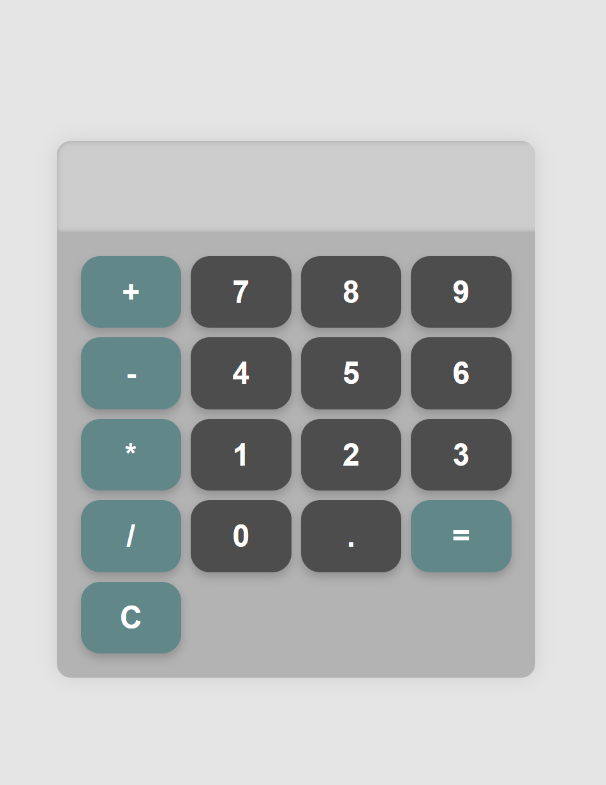

# Simple Web Calculator

This is a simple calculator app built using HTML, CSS, and JavaScript. It performs basic arithmetic operations such as addition, subtraction, multiplication, and division.

## Demo



## Features

- Responsive design for both desktop and mobile
- Supports keyboard input for numbers and operations
- Real-time calculation results
- Includes basic arithmetic operators (`+`, `-`, `*`, `/`)
- Clear (`C`) button to reset the display

## How to Run the Project

1. Clone the repository or download the files.
2. Open the `index.html` file in your web browser to run the calculator.

### File Structure

```plaintext
.
├── index.html  # Main HTML file
├── style.css   # Stylesheet
├── index.js    # JavaScript logic
└── README.md   # Project documentation (this file)
```
